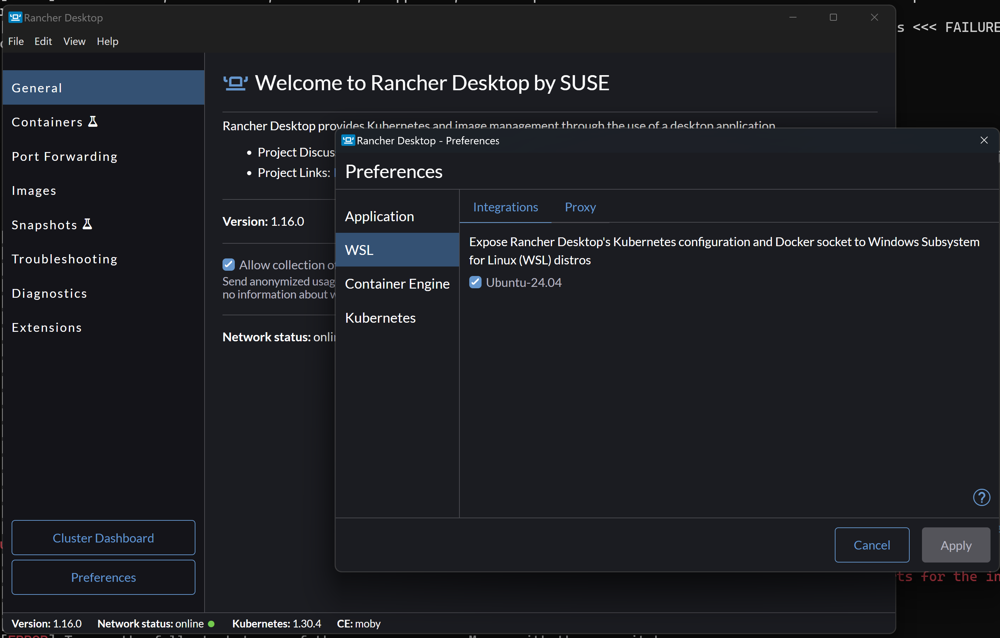

# Rule-based LLMs

This project demonstrates the integration of Large Language Models (LLMs) with a rule engine.

For an in-depth understanding, refer to [this presentation](<doc/Rule-based LLMs Presentation.pptx>) and [this video](<doc/Rule-based LLMs Video.mp4>).

This solution features a chatbot powered by an LLM that interacts with rule-based Decision Services. 

When a user's question can be resolved through an existing Decision Service, the LLM provides the necessary parameters to call the service and uses the result to answer the query.


We are using [IBM Operational Decision Manager](https://www.ibm.com/products/operational-decision-manager) and [IBM Automation Decision Services](https://www.ibm.com/products/automation-decision-services) to demonstrate rule-based decision services.


### Sub-projects:
- **rule-agent**: A Python-based implementation of the chatbot backend using Langchain.
- **decision-services**: A collection of sample IBM ODM and IBM ADS decision services.
- **chatbot-frontend**: A React-based web application that interfaces with the chatbot backend.

See dedicated READMEs in all sub-projects

# Running the Demo Application

A demo application (HR Service) showcases the system’s capabilities. Follow the instructions below to run the demo and explore the integration.

[](doc/rules_and_llms_video.mp4)

---

## Prerequisites

Ensure your system meets the requirements and all dependencies are installed. 

This demo has been successfully tested on MacOS M1 and Windows 11 using Rancher Desktop. We strongly recommend using these configurations.

- **Docker**
  - [Install Rancher Desktop on macOS](https://docs.rancherdesktop.io/getting-started/installation#windows)
  - [Install Rancher Desktop on Windows](https://docs.rancherdesktop.io/getting-started/installation#windows)
- **docker-compose**: Installed automatically with Rancher Desktop.
- **git**

---

### Setup Instructions for Windows OS with Rancher

To run the demonstration on Windows, you'll need to enable [WSL (Windows Subsystem for Linux)](https://learn.microsoft.com/fr-fr/windows/wsl/install).

Once WSL is enabled, configure Rancher Desktop to support it:




## Running the demonstration

You can run this demonstration using two different LLM configurations and depending on your setup, follow the respective guide below:

1. [Running with Ollama (Local)](README_LOCAL.md) using [Ollama](https://ollama.com/), where the LLM runs directly on your machine.
2. [Running with Watsonx.ai (Cloud)](#running-with-watsonx-ai-cloud) using [Watsonx.ai](https://www.ibm.com/watsonx), accessing IBM's AI models in the cloud.


### Using the chatbot UI

On this URL: http://localhost:8080 (or http://localhost:5173/ if you are running outside Docker), you have a Chatbot web application in which you can ask questions that will be answered by the combination of the underlying LLM and rule-based decision services. 

The answer can be answered by the LLM only, augmented with a policy document provided using RAG. If you click on ```Use Decision Services``` toggle, the policy document will not be used but registered Decision Services will to answer the question. 

With the pre-packaged HR Service application, you can ask the following question: 

```
John Doe is an Acme Corp employee who has been hired on November 1st, 1999. How many vacation days the employee John Doe can take each year?
```

Using the policy document, an answer similar to that will be generated:
```
Based on the context provided, John Doe, being an Acme Corp employee with less than 10 years of service, is entitled to three weeks of vacation per year.
```

Note that this answer is wrong. The business policies to determine how much time-off days this employee is eligible to have not been interpreted correctly. 

If using the Decision Service implementing these business policies, the answer should be similar to:

```
John Doe, being an Acme Corp employee, gets to enjoy 43 days of vacation each year.
```

Note that this answer is correct as it is based on the response provided by the Decision Service which implements the corporate business policies to determine how much time-off days an Acme Corp employee is eligible to. 


## Using the application 

An HR Service example is pre-package with the application. The source for this example is provided in the ```decision_services``` directory. You can find here an ADS implementation (```decision_services/hr_decision_service/HRDecisionService.zip```) and an ODM implementation (the XOM and the RuleProject). 

By default, the corresponding Ruleapp is deployed to ODM is linked to the application with the tool descriptor ```data/hrservice/tool_descriptors/hrservice.GetNumberOfVacationPerYearInput.json```. 

If you want to use the ADS version, you need to have access to an ADS service, import the ```decision_services/hr_decision_service/HRDecisionService.zip``` and deploy the decision service. You also need to set-up the backend application to use ADS: see [Setup ADS](#setup-ads) section in this Readme.

You then need to rename ```data/hrservice/tool_descriptors/hrservice.GetNumberOfVacationPerYearInput.json.ads``` to ```data/hrservice/tool_descriptors/hrservice.GetNumberOfVacationPerYearInput.json``` so that the application can use it.   

# Adding a new use-case 

Follow the following instructions to add a new use-case to the application. 

1. add a new directory with the name of your use-case in the ```data``` directory
2. in ```data/<your use-case>/catalog```, add a PDF file with the policies you want to bring to the LLM context.
3. in ```data/<your use-case>/tool_descriptors``` directory, add a new descriptor to interface your decision service so that it can be used by the application. 
4. if you are using ODM, you can drop your decision application (ruleapp) in ```data/<your use-case>/decisionapps``` directory.

### Register a policy document

A policy document can be provided as a PDF file in ```data/<your use-case>/catalog``` to be added to the LLM context. 

### Registering Decision Services as a tool in the LLM application

Whether you're using ODM or ADS, the decision service needs to be deployed to a Decision Runtime and exposed as a REST API. 

For instance, if deployed in ODM running locally on your machine, the decision service is exposed at a URL similar to that: 

```
http://localhost:9060/DecisionService/hr_decision_service/1.0/number_of_timeoff_days/1.0
```

If the decision service is deployed in ADS, the URL is similar to that:

```
https://<ads_host>:443/ads/runtime/api/v1/deploymentSpaces/embedded/decisions/<userid>/%2Fhrdecisionautomation%2Fhrdecisionservice%2FHRDecisionServiceDecisionService%2F1.0.0%2FHRDecisionServiceDecisionService-1.0.0.jar/operations/mainflow_flow/execute
```

The decision service information needs to be registered in a Tool Descriptor to be used by the LLM application.

The Tool Descriptor is a JSON file stored in the ```data/<decision_service>/tool_descriptors``` directory. with the following information: 

```json
{
    "engine" :  <rule engine: odm or ads>,
    "toolName" : <name of the tool>,
    "toolDescription" : <description of the tool>,
    "toolPath" :  <path to the deployed decision service>,
    "args" : [ 
        <list of parameters for the decision service with the following schema:>
        {
            "argName" : <name of the parameter>, "argType": <type of the parameter - str, number, bool>, "argDescription": <description of the parameter>
        }
    ],
    "output" : <output property of the returned object to be used as the answer>
}
```

For instance, for the HR Decision Service example deployed in ODM, the tool descriptor file is similar to this: 

```json
{
    "engine" :  "odm",
    "toolName" : "GetNumberOfVacationDaysPerYearInput",
    "toolDescription" : "retrieve the number of vacation days per year for a given employee and his hiring date.",
    "toolPath" :  "/hr_decision_service/1.0/number_of_timeoff_days/1.0",
    "args" : [
        {
            "argName" : "employeeId", "argType": "str", "argDescription": "the employee name"
        },
        {
            "argName" : "hiringDate", "argType": "str", "argDescription": "the hiring date"
        }
    ],
    "output" : "timeoffDays"
}
```

If the HR Decision Service example is deployed in ADS, the tool descriptor file is similar to this:

```json
{
    "engine" :  "ads",
    "toolName" : "GetNumberOfVacationDaysPerYearInput",
    "toolDescription" : "retrieve the number of vacation days per year for a given employee and his hiring date.",
    "toolPath" :  "%2Fhrdecisionautomation%2Fhrdecisionservice%2FHRDecisionServiceDecisionService%2F1.0.0%2FHRDecisionServiceDecisionService-1.0.0.jar/operations/mainflow_flow/execute",
    "args" : [
        {
            "argName" : "employeeId", "argType": "str", "argDescription": "the employee name"
        },
        {
            "argName" : "hiringDate", "argType": "str", "argDescription": "the hiring date"
        }
    ],
    "output" : "timeoffDays"
}
```

### Deploying the Decision Service

You can either deploy your Decision Service in ODM or ADS manually or, if you want to use ODM, the application will automatically deploy all ruleapps stored in ```data/<your use-case>/decisionapps```. You can use ODM RES Console or ODM Decision Center to retrieve the Ruleapp. 

Make sure the ODM or ADS URL and the decision service path match what has been described in the descriptor files. 

# FAQ

   * If you're running into memory issue with Docker (err 137), try:

```sh
docker system prune
```
   * If docker-compose is not found, try:

```sh
docker compose up 
```
# License
The files in this repository are licensed under the [Apache License 2.0](LICENSE).

# Copyright
© Copyright IBM Corporation 2024.
