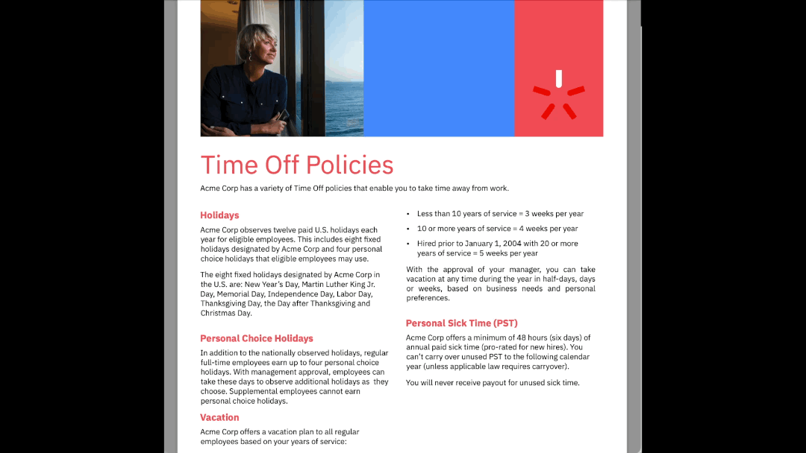

# Rule-based LLMs

This project demonstrates the integration of Large Language Models (LLMs) with a rule engine.

For an in-depth understanding, refer to [this presentation](<doc/Rule-based LLMs Presentation.pptx>) and [this video](<doc/Rule-based LLMs Video.mp4>).

This solution features a chatbot powered by an LLM that interacts with rule-based Decision Services. 

When a user's question can be resolved through an existing Decision Service, the LLM provides the necessary parameters to call the service and uses the result to answer the query.


We are using [IBM Operational Decision Manager](https://www.ibm.com/products/operational-decision-manager) and [IBM Automation Decision Services](https://www.ibm.com/products/automation-decision-services) to demonstrate rule-based decision services.


### Sub-projects:
- **rule-agent**: A Python-based implementation of the chatbot backend using Langchain.
- **decision-services**: A collection of sample IBM ODM and IBM ADS decision services.
- **chatbot-frontend**: A React-based web application that interfaces with the chatbot backend.

See dedicated READMEs in all sub-projects

# Running the Demo Application

A demo application (HR Service) showcases the system’s capabilities. Follow the instructions below to run the demo and explore the integration.



---

## Prerequisites

Ensure your system meets the requirements and all dependencies are installed. 

This demo has been successfully tested on MacOS M1 and Windows 11 using Rancher Desktop. We strongly recommend using these configurations.

- **Docker**
  - [Install Rancher Desktop on macOS](https://docs.rancherdesktop.io/getting-started/installation#windows)
  - [Install Rancher Desktop on Windows](https://docs.rancherdesktop.io/getting-started/installation#windows)
- **docker-compose**: Installed automatically with Rancher Desktop.
- **git**

---

### Setup Instructions for Windows OS with Rancher

To run the demonstration on Windows, you'll need to enable [WSL (Windows Subsystem for Linux)](https://learn.microsoft.com/fr-fr/windows/wsl/install).

Once WSL is enabled, configure Rancher Desktop to support it:


## Setting up your environement for the demonstration

You can run this demonstration using two different LLM configurations and depending on your setup, follow the respective guide below:

1. [Running with Ollama (Local)](README_LOCAL.md) using [Ollama](https://ollama.com/), where the LLM runs directly on your machine.
2. [Running with Watsonx.ai (Cloud)](README_WASTONX.md) using [Watsonx.ai](https://www.ibm.com/watsonx), accessing IBM's AI models in the cloud.


### Launch the docker topology

1. Open a new terminal
2. Build the docker demonstration 
```shell
docker-compose build
```
Once the build process completes

3. Run the demonstration
```shell
docker-compose up
```
This will run the ODM for Developpers docker images in conjonction with the sample web application.
Wait

4. Wait a few minutes until you see the message `` * Running on all addresses (0.0.0.0)```
5. Now that the demo is set up, you're ready to use it. For further instructions on how to interact with the demo, please refer to the next step [Usage Guide](#using-the-chatbot-ui).

> Notes: 
> If you are already running ODM somewhere, you need to set-up the following environment variables:
>```sh
> export ODM_SERVER_URL=<ODM Runtime URL>
> export ODM_USERNAME=<ODM user, default odmAdmin>
> export ODM_PASSWORD=<ODM user password, default odmAdmin>
> ```
> And change the docker-compose.yml file accordingly. 


> If you want to run this demonstration with ADS instead of Operation Decision Manager see this [documentation](README_ADS.md)


### Demo Walkthrough: Chatbot and Rule-based Decision Services

Once the Docker setup is complete, access the chatbot web application at [http://localhost:8080](http://localhost:8080). 

In this chatbot, you can ask questions that will be answered by combining the capabilities of the underlying LLM and the rule-based decision services. 

The chatbot can answer questions in two modes:
- **LLM-only**: The answer is generated purely by the LLM, possibly augmented with policy documents via Retrieval-Augmented Generation (RAG).
- **Decision Services mode**: If you activate the "Use Decision Services" toggle, the chatbot will query registered Decision Services instead of relying on policy documents.

#### Demo Scenario: HR Service Example

With the pre-packaged HR Service application, you can ask the following example question:

```
John Doe is an Acme Corp employee who was hired on November 1st, 1999. How many vacation days is John Doe entitled to each year?
```

In **LLM-only mode** (augmented with the policy document), the response might look like this:

```
Based on the context provided, John Doe, being an Acme Corp employee with less than 10 years of service, is entitled to three weeks of vacation per year.
```

Note that this answer is **incorrect**. The business policies have not been interpreted accurately by the LLM.

When switching to **Decision Services mode**, the chatbot uses the rule-based decision service to generate the response. The correct answer would be:

```
John Doe, being an Acme Corp employee, is entitled to 43 days of vacation per year.
```

This answer is based on the business policies encoded within the decision service, ensuring accuracy in the interpretation of corporate rules.


## Using the application 

An HR Service example is pre-package with the application. The source for this example is provided in the ```decision_services``` directory. You can find here an ADS implementation (```decision_services/hr_decision_service/HRDecisionService.zip```) and an ODM implementation (the XOM and the RuleProject). 

By default, the corresponding Ruleapp is deployed to ODM is linked to the application with the tool descriptor ```data/hrservice/tool_descriptors/hrservice.GetNumberOfVacationPerYearInput.json```. 

If you want to use the ADS version, you need to have access to an ADS service, import the ```decision_services/hr_decision_service/HRDecisionService.zip``` and deploy the decision service. You also need to set-up the backend application to use ADS: see [Setup ADS](#setup-ads) section in this Readme.

You then need to rename ```data/hrservice/tool_descriptors/hrservice.GetNumberOfVacationPerYearInput.json.ads``` to ```data/hrservice/tool_descriptors/hrservice.GetNumberOfVacationPerYearInput.json``` so that the application can use it.   

# Extending the demonstration with a Custom Use-Case

Follow this [instructions](README_EXTEND.md) to add a new use-case to the application. 


# FAQ

   * If you're running into memory issue with Docker (err 137), try:

```sh
docker system prune
```
   * If docker-compose is not found, try:

```sh
docker compose up 
```
# License
The files in this repository are licensed under the [Apache License 2.0](LICENSE).

# Copyright
© Copyright IBM Corporation 2024.
