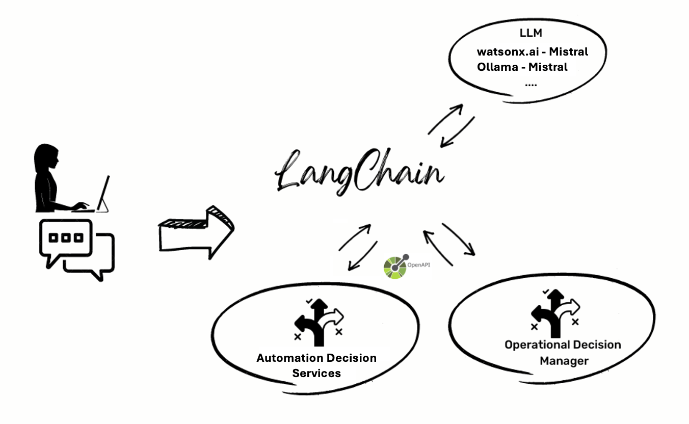
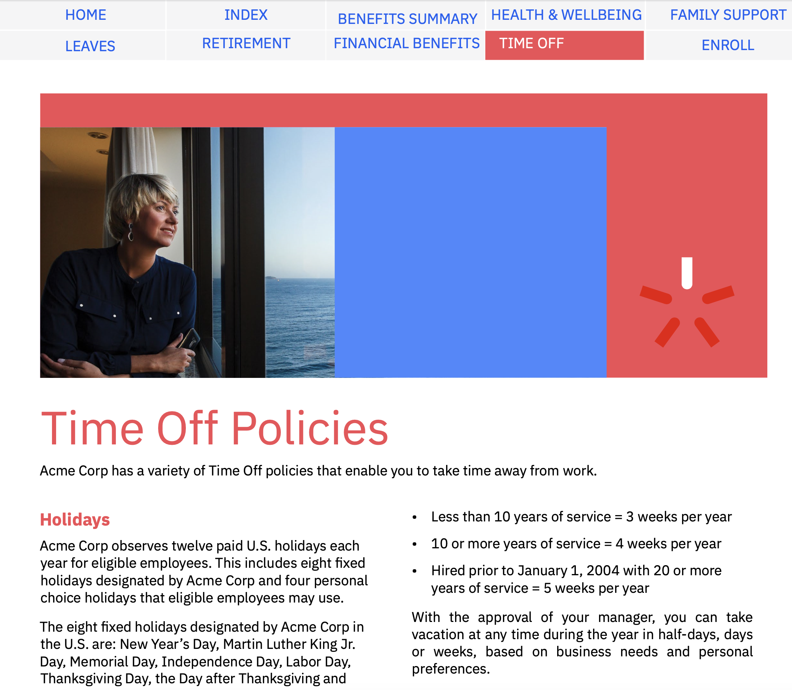

# Rule-based LLMs

This project illustrates the combination of LLMs with a rule engine. 

Please check out [this presentation](<doc/Rule-based LLMs Presentation.pptx>) and [this video](<doc/Rule-based LLMs Video.mp4>) for an exhaustive presentation of what this project is about. 

It features a chatbot powered by a LLM which has access to rule-based Decision Services. When the question
can be answered by an existing Decision Service, the LLM provides the parameters to call this Decision Service
and uses the response to anwser the user question. 



In this project, we're using [IBM Operational Decision Manager](https://www.ibm.com/products/operational-decision-manager) and [IBM Automation Decision Services](https://www.ibm.com/products/automation-decision-services) to illustrate how to implement rule-based decision services. 

There are several sub-projects:
- rule-agent: a Langchain for Python implementation of the chatbot backend. 
- decision-services: some examples of IBM ODM and IBM ADS decision services
- chatbot-frontend:  a React web application to interact with the conversational backend. 

See dedicated READMEs in all sub-projects

# Running the Demo Application

A demonstration application (HR Service) is available to showcase the capabilities of the integrated system. Follow the step-by-step guide to run the demo and explore the features of this innovative integration.

[](doc/rules_and_llms_video.mp4)

## Prerequisites
Before installation, ensure that all necessary prerequisites are met, including system requirements and software dependencies.

  * Docker
  * docker-compose
  * Linux, Windows with WS or Macbook M1 or equivalent with a NVidia GPU card.
  * git

## Quick Steps to demo

Here are some quick steps to get the demo running using IBM watsonx.ai cloud service and IBM ODM locally:

1. Set-up connection to IBM watsonx.ai

See [Setup watsonx.ai](#setup-ibm-wastonxai)

2. run ODM:
```sh
docker-compose --profile odm up
```

3. build the application:
```sh
docker-compose --profile dev build
```

4. run the demo:
```sh
docker-compose --profile dev up
```
5. use chatbot: 
```
http://localhost:8080
```
with the following question:
```
John Doe is an Acme Corp employee who has been hired on November 1st, 1999. How many vacation days the employee John Doe can take each year?
```


## Installation Instructions

### Clone the code
1. Open a new terminal
```shell
git clone https://github.com/DecisionsDev/rule-based-llms.git
cd rule-based-llms
```

You can use Ollama or WatsonX as a LLM service. Follow the steps below depending on the LLM service you want to use.

### Setup IBM wastonx.ai

1. Create a watsonx.ai account. Follow links from https://www.ibm.com/products/watsonx-ai to set-up a Cloud instance.
2. Generate an API key in your ```Profile and settings``` section.
3. Edit the ```wastonx.env``` file:
  * Uncomment the relevant line and set your WatsonX API key.

Then you can proceed to the next step: [Launch the docker topology](#launch-the-docker-topology) or [Run the application locally](#launch-the-application-locally)

If you run the application outside Docker, you need to set your following environment variable:

```sh
export LLM_TYPE=WATSONX
export WATSONX_URL=<URL to watsonx.ai>
export WATSONX_APIKEY=<your watsonx API Key>
export WATSONX_MODEL_NAME=ibm/granite-13b-chat-v2
```

### Setup Ollama
[Ollama](https://ollama.ai/) allows you to run open-source large language models, such as Llama 2 or Mistral, locally.

Ollama bundles model weights, configuration, and data into a single package, defined by a Modelfile.

You can either, download locally:

1. [Download and run](https://ollama.ai/download) the app
2. Once Ollma is up and running, you should download a model. For this sample we will used mistral model.
For a complete list of supported models and model variants, see the [Ollama model library](http://ollama.ai/library).
3. From command line, fetch the llava model.
   
```shell
ollama pull mistral
```

Or run it using docker compose:
```sh
docker-compose --profile ollama up
```
> Note that running Ollama in Docker is particularly slow. 

Ollama is served on [localhost:11434](http://localhost:11434)

> In some OS configuration you should [allow additional web origins to access Ollama](https://github.com/ollama/ollama/blob/main/docs/faq.md#how-can-i-allow-additional-web-origins-to-access-ollama). 

For instance, if you are using Podman as your Docker engine and run Ollama outside docker, you need to set these 2 variables before starting Ollama. It will allow Docker containers to access your local instance of Ollama:

```sh
launchctl setenv OLLAMA_HOST "0.0.0.0"
launchctl setenv OLLAMA_ORIGINS "*"
```

If you run the application outside Docker, you need to set your following environment variable:

```sh
export LLM_TYPE=LOCAL_OLLAMA
export OLLAMA_SERVER_URL=http://localhost:11434
export OLLAMA_MODEL_NAME=mistral
```

### Setup ODM 

If you want to run IBM ODM locally, you can launch it using Docker: 
```sh
docker-compose --profile odm up
```

If you are already running ODM somewhere, you need to set-up the following environment variables:

```sh
export ODM_SERVER_URL=<ODM Runtime URL>
export ODM_USERNAME=<ODM user, default odmAdmin>
export ODM_PASSWORD=<ODM user password, default odmAdmin>
```
And change the docker-compose.yml file accordingly. 

### Setup ADS

If you want to use IBM ADS, you need to have access to an ADS service. 

Set the following environment variables:
```sh
export ADS_SERVER_URL=<URL of your ADS service>
export ADS_USER_ID=<your ADS user ID>
export ADS_APIKEY=<your ADS API Key>
export ADS_ZEN_APIKEY=<your ADS Zen API Key>
```

Note: the ADS User ID can be retrieved in the ```Profile & Settings``` section in ADS console. It's the userID below your real name. 

If you're running the application with Docker, you need to edit the ```ads.env``` file to set those variables. 

#### Generate the Zen API Key

You can retrieve an ADS API Key in the ```Profile & Settings``` section in ADS console. 

From the ADS User ID and the ADS API Key you need to generate a Zen API key using the following commands:

```sh
w3user=$ADS_USER_ID
apikey=$ADS_APIKEY
apikeyheader="ZenApiKey $(echo $w3user:$apikey | base64)"
echo $apikeyheader
```

On a Linux machine, use the following commands:

```sh
w3user=$ADS_USER_ID
apikey=$ADS_APIKEY
apikeyheader="ZenApiKey $(echo $w3user:$apikey | base64 -w0)"
echo $apikeyheader
```

Use the resulting value as the value for ADS_ZEN_APIKEY variable. 

## Launch the Docker topology

<u>Important Note:</u>

If you are using Podman as your Docker engine and want to use ODM or Ollama running outside Docker, you need to apply the following instruction:
In the ```docker-compose.yml``` file, you need to comment out the ```extra_host``` line refering to ```host-gateway``` and add a line that refers to the IP address of your machine. (Use ```ipconfig``` to find the IP address of your machine). See the following example: 

```
    extra_hosts:
#      - "host.containers.internal:host-gateway"
      - "host.containers.internal:<my IP address>"
```
The following docker-compose profiles are available:
  * `dev`: Runs the chatbot front end and backend services
  * `ollama`: Runs the ollama service
  * `odm`: Runs the odm service

Here are the instructions to run the application in Docker:
1. Open a new terminal
2. Run ODM with Docker:
```shell
docker-compose --profile odm up
```
3. If you want to use Ollama and if you want to run it with Docker:
```shell
docker-compose --profile ollama up
```
> Note that it can take a significant time as it will pull the mistral model which is several gigabytes. 
3. Build the docker demonstration 
```shell
docker-compose --profile dev build
```
4. Once the build is finished. Run the demonstration
```shell
docker-compose --profile dev up
```
4. Wait a couple of minutes until all services have finished setting up.
5. Then open a browser to this url : http://localhost:8080 (chatbot frontend)

> If there is an error when contacting Ollama server you can try this workaround. Edit the ```ollama.env``` file and change the line ```OLLAMA_SERVER_URL=http://host.docker.internal:11434``` by ```OLLAMA_SERVER_URL=http://YOURIP:11434```

## Launch the application locally

You can run the application outside of Docker if you want to. To do so, you need to:
1. set the environment variables corresponding to the configuration you want to use (Ollama or watsonx.ai, ODM or ADS)
2. launch the backend application in ```rule-agent``` directory. Refer to the Readme in this location.
3. launch the frontend application in ```chatbot-frontend``` directory. Refer to the Readme in this location.
4. make sure the Decision Service is deployed in ODM or ADS
5. launch you web browser to the following URL: http://localhost:5173/


## Using the application 

An HR Service example is pre-package with the application. The source for this example is provided in the ```decision_services``` directory. You can find here an ADS implementation (```decision_services/hr_decision_service/HRDecisionService.zip```) and an ODM implementation (the XOM and the RuleProject). 

By default, the corresponding Ruleapp is deployed to ODM is linked to the application with the tool descriptor ```data/hrservice/tool_descriptors/hrservice.GetNumberOfVacationPerYearInput.json```. 

If you want to use the ADS version, you need to have access to an ADS service, import the ```decision_services/hr_decision_service/HRDecisionService.zip``` and deploy the decision service. You also need to set-up the backend application to use ADS: see [Setup ADS](#setup-ads) section in this Readme.

You then need to rename ```data/hrservice/tool_descriptors/hrservice.GetNumberOfVacationPerYearInput.json.ads``` to ```data/hrservice/tool_descriptors/hrservice.GetNumberOfVacationPerYearInput.json``` so that the application can use it.   

### Using the chatbot UI

On this URL: http://localhost:8080 (or http://localhost:5173/ if you are running outside Docker), you have a Chatbot web application in which you can ask questions that will be answered by the combination of the underlying LLM and rule-based decision services. 

The answer can be answered by the LLM only, augmented with a policy document provided using RAG. If you click on ```Use Decision Services``` toggle, the policy document will not be used but registered Decision Services will to answer the question. 

With the pre-packaged HR Service application, you can ask the following question: 

```
John Doe is an Acme Corp employee who has been hired on November 1st, 1999. How many vacation days the employee John Doe can take each year?
```

Using the policy document, an answer similar to that will be generated:
```
Based on the context provided, John Doe, being an Acme Corp employee with less than 10 years of service, is entitled to three weeks of vacation per year.
```

Note that this answer is wrong. The business policies to determine how much time-off days this employee is eligible to have not been interpreted correctly. 

If using the Decision Service implementing these business policies, the answer should be similar to:

```
John Doe, being an Acme Corp employee, gets to enjoy 43 days of vacation each year.
```

Note that this answer is correct as it is based on the response provided by the Decision Service which implements the corporate business policies to determine how much time-off days an Acme Corp employee is eligible to. 

# Adding a new use-case 

Follow the following instructions to add a new use-case to the application. 

1. add a new directory with the name of your use-case in the ```data``` directory
2. in ```data/<your use-case>/catalog```, add a PDF file with the policies you want to bring to the LLM context.
3. in ```data/<your use-case>/tool_descriptors``` directory, add a new descriptor to interface your decision service so that it can be used by the application. 
4. if you are using ODM, you can drop your decision application (ruleapp) in ```data/<your use-case>/decisionapps``` directory.

### Register a policy document

A policy document can be provided as a PDF file in ```data/<your use-case>/catalog``` to be added to the LLM context. 

### Registering Decision Services as a tool in the LLM application

Whether you're using ODM or ADS, the decision service needs to be deployed to a Decision Runtime and exposed as a REST API. 

For instance, if deployed in ODM running locally on your machine, the decision service is exposed at a URL similar to that: 

```
http://localhost:9060/DecisionService/hr_decision_service/1.0/number_of_timeoff_days/1.0
```

If the decision service is deployed in ADS, the URL is similar to that:

```
https://<ads_host>:443/ads/runtime/api/v1/deploymentSpaces/embedded/decisions/<userid>/%2Fhrdecisionautomation%2Fhrdecisionservice%2FHRDecisionServiceDecisionService%2F1.0.0%2FHRDecisionServiceDecisionService-1.0.0.jar/operations/mainflow_flow/execute
```

The decision service information needs to be registered in a Tool Descriptor to be used by the LLM application.

The Tool Descriptor is a JSON file stored in the ```data/<decision_service>/tool_descriptors``` directory. with the following information: 

```json
{
    "engine" :  <rule engine: odm or ads>,
    "toolName" : <name of the tool>,
    "toolDescription" : <description of the tool>,
    "toolPath" :  <path to the deployed decision service>,
    "args" : [ 
        <list of parameters for the decision service with the following schema:>
        {
            "argName" : <name of the parameter>, "argType": <type of the parameter - str, number, bool>, "argDescription": <description of the parameter>
        }
    ],
    "output" : <output property of the returned object to be used as the answer>
}
```

For instance, for the HR Decision Service example deployed in ODM, the tool descriptor file is similar to this: 

```json
{
    "engine" :  "odm",
    "toolName" : "GetNumberOfVacationDaysPerYearInput",
    "toolDescription" : "retrieve the number of vacation days per year for a given employee and his hiring date.",
    "toolPath" :  "/hr_decision_service/1.0/number_of_timeoff_days/1.0",
    "args" : [
        {
            "argName" : "employeeId", "argType": "str", "argDescription": "the employee name"
        },
        {
            "argName" : "hiringDate", "argType": "str", "argDescription": "the hiring date"
        }
    ],
    "output" : "timeoffDays"
}
```

If the HR Decision Service example is deployed in ADS, the tool descriptor file is similar to this:

```json
{
    "engine" :  "ads",
    "toolName" : "GetNumberOfVacationDaysPerYearInput",
    "toolDescription" : "retrieve the number of vacation days per year for a given employee and his hiring date.",
    "toolPath" :  "%2Fhrdecisionautomation%2Fhrdecisionservice%2FHRDecisionServiceDecisionService%2F1.0.0%2FHRDecisionServiceDecisionService-1.0.0.jar/operations/mainflow_flow/execute",
    "args" : [
        {
            "argName" : "employeeId", "argType": "str", "argDescription": "the employee name"
        },
        {
            "argName" : "hiringDate", "argType": "str", "argDescription": "the hiring date"
        }
    ],
    "output" : "timeoffDays"
}
```

### Deploying the Decision Service

You can either deploy your Decision Service in ODM or ADS manually or, if you want to use ODM, the application will automatically deploy all ruleapps stored in ```data/<your use-case>/decisionapps```. You can use ODM RES Console or ODM Decision Center to retrieve the Ruleapp. 

Make sure the ODM or ADS URL and the decision service path match what has been described in the descriptor files. 

# FAQ

   * If you're running into memory issue with Docker (err 137), try:

```sh
docker system prune
```
   * If docker-compose is not found, try:

```sh
docker compose --profile odm up 
```
# License
The files in this repository are licensed under the [Apache License 2.0](LICENSE).

# Copyright
© Copyright IBM Corporation 2024.
